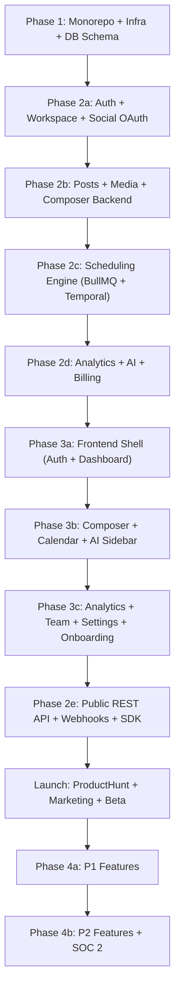

# SocialSphear — Production Implementation Plan

SocialSphear is a next-generation, AI-powered social media management and scheduling SaaS. This plan covers the full engineering implementation from monorepo bootstrap to P2 feature parity, spanning a production-grade TypeScript-native stack. All timelines from the original documents are **intentionally omitted** — this plan is sequenced by dependency, not by calendar date.

---

## Open Questions

> [!IMPORTANT]
> Please review and clarify these decisions before execution begins. They directly impact architecture choices.

1. **Clerk organization vs. workspace**: Should Clerk Organizations be the source of truth for workspace membership, or is Clerk used only for authentication with all workspace logic in Postgres? (The tech spec mirrors workspace data in Postgres — recommended to keep it that way.)
2. **tRPC vs. REST split**: Should tRPC be used **only** for internal frontend↔backend calls, with the public `api.socialsphear.com/v1` being a separate NestJS REST controller layer? **(Recommended: yes.)**
3. **Temporal hosting**: Railway does not natively run Temporal workers + server. Should Temporal be hosted on **Temporal Cloud** (managed, zero-ops, ~$25/month) or self-hosted on a separate Railway service?
4. **ClickHouse Cloud tier**: Development tier is free (1 TB limit); Production tier starts at ~$300/month. Which to start on?
5. **pgvector**: Supabase supports `pgvector` natively. Confirm the extension is enabled on your Supabase project before the AI milestone.
6. **Public SDK**: Should `@socialsphear/sdk` (TypeScript/JS SDK) be published as its own npm package from the monorepo? If yes, it becomes `packages/sdk` in Turborepo.

---

## Proposed Changes

The implementation is organized into **4 phases**, each a strict dependency layer. Every phase must be complete before the next begins.

---

### Phase 1 — Monorepo Foundation & Infrastructure

This is the bedrock. Nothing else can be built without it.

---

#### [NEW] `socialsphear/` — Turborepo Monorepo Root

Initialize with `pnpm` workspaces. All packages and apps share hoisted `node_modules`.

```
socialsphear/
├── apps/
│   ├── web/          # Next.js 15 (App Router)
│   └── api/          # NestJS backend
├── packages/
│   ├── types/        # Shared Zod schemas + TypeScript types
│   ├── db/           # Prisma schema, client, migrations
│   ├── ui/           # Shared Shadcn/UI component library
│   ├── config/       # ESLint, TS, Tailwind base configs
│   └── ai/           # Shared Vercel AI SDK wrappers
├── turbo.json
├── package.json
└── pnpm-workspace.yaml
```

**Key setup tasks:**
- `turbo.json` pipelines: `lint → typecheck → test → build` with remote caching
- `packages/types`: all Zod schemas exported; consumed by both `web` and `api`
- `packages/db`: Prisma client singleton + PgBouncer connection pooling via Supabase
- GitHub branch protection: `main` requires 1 approval + passing CI

---

#### [NEW] `packages/db/prisma/schema.prisma` — Complete Database Schema

Full Prisma schema covering all entities defined in the tech spec:

| Table | Purpose |
|---|---|
| `users` | Mirrored from Clerk — holds `clerk_id`, email, name, avatar |
| `workspaces` | One per brand/client — name, slug, logo_url, plan, owner_id |
| `team_members` | Workspace membership — user_id, workspace_id, role, invite_status |
| `social_accounts` | Connected OAuth accounts — encrypted `access_token`, `refresh_token` (BYTEA) |
| `posts` | Content unit — content, media_urls (JSONB), platform_overrides (JSONB), status, approval_status |
| `post_jobs` | One row per platform per post — status, platform_post_id, published_at, retry_count |
| `media_files` | Uploaded media — r2_key, cloudinary_public_id, variants (JSONB), size_bytes |
| `ai_credits` | Monthly usage ledger — workspace_id, month, credits_used, plan_allowance |
| `brand_voice_examples` | Training posts — content, embedding (vector(1536) via pgvector) |
| `activity_log` | Append-only audit log — workspace_id, user_id, action, metadata (JSONB) |
| `webhooks` | User-configured webhook endpoints — url, events[], secret_hash |
| `webhook_deliveries` | Delivery log — webhook_id, event, status, response_code, attempts |
| `api_keys` | Developer API keys — key_hash, name, workspace_id, last_used_at |
| `rss_feeds` | RSS auto-posting sources — url, workspace_id, last_fetched_at |

**Performance-critical indexes:**
- `posts(workspace_id, scheduled_at)` — calendar query
- `posts(workspace_id, status)` — filtered list query
- `post_jobs(post_id)` — per-post delivery status
- `social_accounts(workspace_id, platform)` — account picker
- `brand_voice_examples(workspace_id)` + IVFFlat index on embedding column

---

#### [NEW] Infrastructure Provisioning Checklist

| Service | Provider | Config |
|---|---|---|
| PostgreSQL | Supabase | Enable pgvector, PgBouncer in transaction mode |
| Redis | Upstash | Global replicated, TLS enforced |
| Blob Storage | Cloudflare R2 | Private bucket, `media/{workspaceId}/` prefix |
| Image CDN | Cloudinary | Auto-upload preset, eager transforms per platform |
| Auth | Clerk | Enable Organizations, configure OAuth apps per platform |
| Email | Resend | Domain: `mail.socialsphear.com` |
| Search | Typesense Cloud | `hashtags` and `media_library` collections |
| Error Tracking | Sentry | One project for `web`, one for `api` |
| Product Analytics | PostHog | Cloud, autocapture on, feature flags enabled |
| Uptime | Better Uptime | HTTP monitors every 60s on all public endpoints |

---

#### [NEW] GitHub Actions CI/CD — 4 Workflow Files

1. **`ci.yml`** — on every push: `lint → typecheck → vitest` (Turborepo cached)
2. **`preview.yml`** — on PR: Playwright E2E on Railway staging + Vercel preview deploy
3. **`deploy.yml`** — on merge to `main`: Vercel prod + Railway prod + `prisma migrate deploy`
4. **`release.yml`** — on tag push: publish `@socialsphear/sdk` to npm

---

### Phase 2 — Backend Services (NestJS + BullMQ + Temporal)

---

#### [NEW] `apps/api/` — NestJS Application Module Structure

```
apps/api/src/modules/
├── auth/            # ClerkGuard — JWT verify, attach userId + orgId
├── workspace/       # CRUD, member management, slug generation
├── social-accounts/ # OAuth flows, token encryption, health checker
├── posts/           # Post CRUD, draft management, platform_overrides
├── scheduler/       # BullMQ producers — enqueue at scheduledAt
├── publisher/       # BullMQ consumers — one worker class per platform
├── analytics/       # ClickHouse ingestion + query service
├── ai/              # Caption gen, image gen, brand voice, hashtags
├── media/           # R2 presigned URLs, Cloudinary triggers, library
├── billing/         # Stripe checkout, webhooks, plan enforcement
├── notifications/   # Socket.io gateway, email triggers via Resend
├── search/          # Typesense indexing and query endpoints
├── webhooks/        # Outbound user webhooks + inbound platform webhooks
└── public-api/      # REST controllers for api.socialsphear.com/v1
```

**tRPC router hierarchy (internal frontend↔backend):**
```
root router
├── workspace.*
├── posts.*
├── socialAccounts.*
├── analytics.*
├── ai.*
├── media.*
├── billing.*
└── notifications.*
```

---

#### [NEW] Social Accounts — OAuth & Token Security

**Critical security requirements:**
- `TokenEncryptionService` — AES-256-GCM, key from `ENCRYPTION_KEY` env var (never in code)
- All tokens stored as `BYTEA` — never plain TEXT in Postgres
- Tokens **never returned to frontend** — only metadata (username, status, expires_at)
- Temporal `TokenRefreshWorkflow` auto-triggers 24h before `token_expires_at`

**Platform OAuth matrix at launch:**

| Platform | API Version | Key Scopes | Token Refresh |
|---|---|---|---|
| Instagram | Graph API v21 | `instagram_content_publish`, `instagram_basic` | Yes (60-day long-lived) |
| Facebook | Graph API v21 | `pages_manage_posts`, `pages_read_engagement` | Yes |
| Twitter/X | v2 | `tweet.read`, `tweet.write`, `offline.access` | Yes |
| LinkedIn | v2 | `w_member_social`, `r_liteprofile` | Yes (60-day) |
| TikTok | Content Posting API v2 | `video.upload`, `video.publish` | Yes |
| Pinterest | v5 | `boards:read`, `pins:write` | Yes |
| YouTube | v3 | `youtube.upload`, `youtube.readonly` | Yes |
| Google Business | v1 | `business.manage` | Yes |
| Threads | v1 | `threads_basic`, `threads_content_publish` | Yes |
| BlueSky | AT Protocol | App password model | N/A |

---

#### [NEW] Scheduling Engine — BullMQ Queues

Six queues with exact retry strategies from the tech spec:

| Queue | Concurrency | Retries | Backoff |
|---|---|---|---|
| `post:schedule` | 50 | 0 | n/a |
| `post:publish` | 20 per platform | 3 | 30s → 2m → 10m |
| `post:notify` | 100 | 2 | 5s |
| `analytics:ingest` | 10 | 5 | 1h |
| `token:refresh` | 5 | 3 | 1m |
| `media:process` | 30 | 2 | 10s |

**Post state machine** (enforced in `PostService`):
```
DRAFT → SCHEDULED → QUEUED → PUBLISHING → PUBLISHED
                                        ↘ RETRYING → PUBLISHED
                                                   ↘ FAILED_PERMANENT
SCHEDULED → CANCELLED
```

**Bull Board** — internal admin queue health view at `/admin/queues` (NestJS admin role guard).

---

#### [NEW] Platform Publisher Adapters

One `PlatformPublisher` interface, one class per platform:

```typescript
interface PlatformPublisher {
  publish(job: PostJob, account: SocialAccount, post: Post): Promise<PublishResult>
  supportsMediaType(type: MediaType): boolean
  getCharacterLimit(): number
}
```

Platform-specific implementation notes:
- **Instagram**: Graph API — 2-step media create → publish; image must be on Cloudinary CDN
- **Twitter/X**: API v2 — 280 char; `ThreadPostWorkflow` for thread sequences
- **LinkedIn**: UGC Post API — image asset upload separate from post create
- **TikTok**: Content Posting API — video-only, init → upload → publish (3 steps)
- **BlueSky**: AT Protocol — `com.atproto.repo.createRecord` with lexicon types

---

#### [NEW] Temporal Workflows

Using **Temporal Cloud** (recommended — managed, Railway-compatible):

| Workflow | Signal Handling | Activity Retries |
|---|---|---|
| `ScheduledPostWorkflow` | `cancel` signal → CANCELLED transition | 3× with exponential backoff |
| `ThreadPostWorkflow` | n/a | 3× per tweet with 2s inter-tweet delay |
| `RecurringPostWorkflow` | `stop` signal → terminates chain | 3× |
| `TokenRefreshWorkflow` | n/a | Daily retry for 3 days, then suspend posts |

---

#### [NEW] ClickHouse Analytics Store

Two tables (from tech spec), plus materialized views:

- `post_metrics` — one row per metric snapshot, `ENGINE = MergeTree()` partitioned by `toYYYYMM(recorded_at)`
- `account_snapshots` — daily follower growth snapshots per account
- **Materialized views**: pre-aggregate daily totals per `workspace_id + platform`
- **Ingestion**: `analytics:ingest` BullMQ job runs 1h after post publishes, calls platform analytics APIs
- **Retention**: 36 months raw, unlimited aggregates
- **Client**: `@depyronick/clickhouse-client` with typed result models in `AnalyticsQueryService`

---

#### [NEW] AI Services

**`CaptionGeneratorService`**
- `claude-sonnet-4-6` via Vercel AI SDK — streaming via tRPC subscription
- Platform post-processing: trim to character limit, inject hashtags
- Response cache: Redis `ai:caption:{hash(topic+tone+platform)}` — 1h TTL
- Brand voice: pgvector cosine similarity search → top-3 examples → injected into system prompt

**`ImageGeneratorService`**
- fal.ai `fal-ai/flux` (512×512, 10 credits) + `fal-ai/flux-pro` (1024×1024, 20 credits)
- Generated images uploaded to R2 + Cloudinary transforms applied

**`AICreditService`**
- Redis counter: `credits:{workspaceId}:{YYYY-MM}` — checked before every AI call
- Monthly reset via BullMQ cron (1st of each month)
- `CREDIT_LIMIT_EXCEEDED` error thrown and surfaced as upgrade prompt

**AI credit cost table:**

| Action | Credits | Notes |
|---|---|---|
| Caption — 1 platform | 1 | Cached: same input within 1h |
| Caption — all platforms | 3 | Platform-specific variants |
| Hashtag suggestions | 1 | Cached per topic per 24h |
| AI image 512×512 | 10 | fal.ai Flux |
| AI image 1024×1024 | 20 | fal.ai Flux Pro |
| Best posting time | 2 | Uses 90-day analytics history |
| Monthly content plan | 15 | LangChain agent (P2) |

---

#### [NEW] Stripe Billing

**Plans and price IDs:**

| Plan | Price | Channels | Team | AI Credits |
|---|---|---|---|---|
| Free | $0/mo | 3 | 1 user | 20 |
| Creator | $19/mo | 10 | 3 users | 200 |
| Pro | $49/mo | 25 | Unlimited | 1,000 |
| Agency | $99/mo | 100 | Unlimited | 5,000 |
| Enterprise | Custom | Unlimited | Unlimited | Unlimited |

**Stripe webhook events handled:**
- `customer.subscription.created/updated` → update `workspace.plan`
- `customer.subscription.deleted` → downgrade to free
- `invoice.payment_failed` → email warning, 7-day grace period
- `invoice.payment_succeeded` → reset monthly AI credit counter

**`PlanGuard`** — NestJS guard that enforces plan limits (channels, AI credits, features) before route execution.

---

#### [NEW] Public REST API (`api.socialsphear.com/v1`)

Separate from tRPC — standard NestJS REST controllers with `@nestjs/swagger` auto-docs.

- **Auth**: `ApiKeyGuard` — SHA-256 hash incoming key, compare to `api_keys.key_hash`
- **Rate limiting**: Redis sliding window per API key, per-plan limits
- **Versioning**: `/v1/` URL prefix; breaking changes → `/v2/`
- **Docs**: Swagger at `api.socialsphear.com/docs`

**Full endpoint inventory at launch (v1.0):**

| Method | Path | Description |
|---|---|---|
| GET | `/workspaces/me` | Current workspace |
| PATCH | `/workspaces/me` | Update name/logo |
| GET | `/workspaces/me/members` | List members |
| GET | `/social-accounts` | List connected accounts |
| GET | `/social-accounts/:id` | Single account |
| GET | `/social-accounts/:id/health` | Token health + expiry |
| DELETE | `/social-accounts/:id` | Disconnect account |
| GET | `/posts` | List posts (cursor-paginated, filterable) |
| POST | `/posts` | Create post (draft or scheduled) |
| GET | `/posts/:id` | Get post + all PostJobs |
| PATCH | `/posts/:id` | Update content, time, platforms |
| DELETE | `/posts/:id` | Delete (pre-publish only) |
| POST | `/posts/:id/schedule` | Schedule a draft |
| POST | `/posts/:id/publish-now` | Immediate publish |
| POST | `/posts/:id/cancel` | Cancel → draft |
| POST | `/posts/:id/duplicate` | Clone as new draft |
| GET | `/posts/calendar` | Date-range calendar query |
| POST | `/media/upload-url` | Presigned R2 upload URL |
| POST | `/media/confirm` | Confirm upload, trigger transforms |
| GET | `/media` | Media library list |
| DELETE | `/media/:id` | Delete media file |
| GET | `/analytics/summary` | Workspace-level metrics |
| GET | `/analytics/posts/:id` | Per-post metrics history |
| GET | `/analytics/accounts/:id` | Account growth over time |
| GET | `/analytics/top-posts` | Top posts by engagement |
| GET | `/analytics/export` | CSV export for date range |
| POST | `/ai/caption` | Generate caption (streaming) |
| POST | `/ai/hashtags` | Generate hashtag suggestions |
| GET | `/ai/best-time` | AI-suggested best posting time |
| GET | `/ai/credits` | Credit usage and plan allowance |
| GET | `/webhooks` | List webhook endpoints |
| POST | `/webhooks` | Create webhook |
| DELETE | `/webhooks/:id` | Delete webhook |
| POST | `/webhooks/:id/test` | Send test event |

---

### Phase 3 — Frontend Application (Next.js 15)

---

#### [NEW] `apps/web/` — App Router Route Structure

```
app/
├── (auth)/
│   ├── sign-in/[[...sign-in]]/page.tsx    # Clerk SignIn
│   └── sign-up/[[...sign-up]]/page.tsx    # Clerk SignUp
├── (onboarding)/
│   └── onboarding/page.tsx                # 6-step guided onboarding
├── (dashboard)/
│   ├── layout.tsx                          # Sidebar + header shell
│   ├── page.tsx                            # Home — overview stats
│   ├── calendar/page.tsx                   # Content calendar
│   ├── composer/page.tsx                   # Post composer
│   ├── analytics/page.tsx                  # Analytics dashboard
│   ├── inbox/page.tsx                      # Social inbox (P1)
│   ├── ai-studio/page.tsx                  # AI tools hub
│   └── settings/
│       ├── page.tsx                        # General settings
│       ├── accounts/page.tsx               # Connected social accounts
│       ├── team/page.tsx                   # Team + invites
│       ├── billing/page.tsx                # Plan + billing portal
│       └── developer/page.tsx             # API keys
├── [username]/page.tsx                     # Link-in-bio (P1, public)
└── api/
    ├── webhooks/clerk/route.ts             # User sync to Postgres
    ├── webhooks/stripe/route.ts            # Stripe events relay
    └── upload/route.ts                     # Media upload proxy
```

---

#### [NEW] Component Architecture

**Composer** (most complex UI surface):

| Component | Responsibility |
|---|---|
| `ComposerEditor` | Tiptap rich text, live character counter per platform |
| `PlatformSelector` | Multi-select with icons, per-platform override toggle |
| `MediaUploader` | Drag-and-drop, progress bar, R2 presigned upload flow |
| `PlatformPreview` | Live preview of post rendering per selected platform |
| `AIAssistSidebar` | Tone selector, caption streaming, hashtag suggestions, regenerate |
| `HashtagInput` | Typesense autocomplete tag chips |

**Calendar:**

| Component | Responsibility |
|---|---|
| `CalendarMonth` | Grid layout, post chips colour-coded by platform |
| `CalendarWeek` | Hourly slots with post cards |
| `CalendarDay` | Full post detail per slot |
| `CalendarDnD` | `@dnd-kit/core` — optimistic update on drop, rollback on error |
| `PostQuickView` | Hover popover — content, platform, scheduled time |
| `BulkSelectBar` | Floating bar for bulk reschedule/delete |

**Analytics (Recharts):**

| Component | Chart Type |
|---|---|
| `EngagementOverTime` | Area chart with platform overlay |
| `FollowerGrowth` | Multi-line chart per platform |
| `PlatformComparison` | Grouped bar chart |
| `TopPostsTable` | Sortable data table with engagement columns |
| `MetricCard` | Summary stat card with period delta |

---

#### [NEW] Zustand State Stores

| Store | State Managed |
|---|---|
| `useWorkspaceStore` | Active workspace, plan, current user role |
| `useComposerStore` | Draft content, selected platforms, media attachments, AI streaming state |
| `useCalendarStore` | View mode (month/week/day), date range, platform + status filters |
| `useNotificationStore` | Unread count, notification list, Socket.io connection state |
| `useUIStore` | Sidebar collapsed, active modal, dark/light theme |

---

#### [NEW] Design System

- **Framework**: Shadcn/UI + Tailwind CSS v4
- **Font**: Inter via Google Fonts
- **Default theme**: Dark mode (user-toggleable)
- **Brand colors**: Deep indigo/violet primary gradient, electric blue accents, layered dark-gray surfaces with glassmorphism
- **Animations**: Motion (Framer Motion) — drag-and-drop, page transitions, AI streaming skeleton

**Key UI patterns:**
- **Optimistic UI**: post appears on calendar immediately; rolled back on API error
- **Streaming AI**: captions stream token-by-token via `useCompletion`
- **Virtual rendering**: `TanStack Virtual` for calendars with 500+ posts
- **Skeleton loading**: every async component has a matching skeleton state
- **Error boundaries**: per-dashboard-section isolation
- **Toast notifications**: `sonner` — success/error/info

---

#### [NEW] Onboarding Flow (5-minute target)

1. **Sign up** → Clerk hosted UI → redirect to `/onboarding`
2. **Create workspace** → name + optional logo
3. **Connect first account** → platform picker → OAuth redirect → success state
4. **Create first post** → composer pre-opened, AI caption auto-suggested
5. **Schedule** → date picker or "Best Time" AI recommendation
6. **Confirmation** → calendar preview with first post visible

Each step tracked with PostHog events for conversion funnel analysis.

---

### Phase 4 — P1 & P2 Feature Expansion

Begins after public launch. All P1/P2 features gated behind PostHog feature flags.

---

#### P1 Features

| Feature | Implementation |
|---|---|
| **AI Image Generation** | fal.ai Flux in `ImageGeneratorService`, prompt UI in composer AI sidebar |
| **Bulk CSV Scheduling** | CSV parser → validate rows → batch `posts.create` → calendar import preview |
| **Link-in-Bio Builder** | Next.js public `[username]` route, WYSIWYG editor in settings |
| **Instagram Grid Preview** | Virtual grid: last 9 published + upcoming scheduled posts |
| **Social Inbox** | Polled comments/DMs via platform APIs, unified feed + inline reply interface |
| **White-Label PDF Reports** | Puppeteer on Railway — Agency plan only, custom logo/colors/client name |
| **RSS Auto-Posting** | BullMQ cron polls RSS feeds, creates draft for each new item |
| **Browser Extension** | Chrome + Firefox MV3 — clips content from any page to SocialSphear draft queue |
| **Canva Integration** | Canva OAuth → import design as image → attach to composer |

---

#### P2 Features

| Feature | Implementation |
|---|---|
| **Social Listening** | Brandwatch or Mention API integration → keyword alerts → email/Slack notifications |
| **Competitor Tracking** | Public profile data + ClickHouse storage, competitor dashboard view |
| **AI Content Planner** | LangChain agent → 30-day calendar plan → loads as drafts in calendar |
| **Video Captions** | OpenAI Whisper API transcription → auto-attached to video media files |
| **TikTok/Reels Native** | Full Content Posting API + Instagram Reels Publishing API |
| **Zapier/Make/n8n** | Publish Zapier app + Make module; webhook trigger+action support |
| **Public API OAuth** | OAuth 2.0 for API keys (replace API key auth with proper OAuth flow) |
| **SOC 2 Type I** | Engage auditor, implement controls, gather 6-month evidence period |

---

## Verification Plan

### Automated Tests

**Unit tests (Vitest):**
```bash
pnpm test
```
- Minimum 80% coverage on new business logic
- Critical: `PostService`, `SchedulerService`, `CaptionGeneratorService`, `AICreditService`, `TokenEncryptionService`

**E2E tests (Playwright — against staging):**
```bash
pnpm e2e
```

Critical paths with mandatory E2E coverage:
1. Sign up → connect Instagram → create post → schedule → verify `post_jobs.status = published`
2. AI caption generation → streaming response → insert into composer editor
3. Upgrade via Stripe Checkout → verify plan limit increase in DB
4. Team invite → accept → Editor submits → Admin approves → post schedules
5. Media upload → presigned URL → R2 → Cloudinary variants available
6. API key creation → REST API call → rate limit enforcement at plan ceiling

### Stress Tests

| Test | Target |
|---|---|
| Enqueue 1,000 posts simultaneously | < 1% failure rate |
| Calendar render with 500 posts | < 200ms (Playwright perf) |
| ClickHouse 90-day analytics query | p99 < 2s |

### Performance Gates (must pass before public launch)

| Metric | Target | How Measured |
|---|---|---|
| LCP | < 1.5s | Web Vitals via Sentry |
| API p50 response | < 100ms | NestJS response middleware |
| API p99 response | < 500ms | NestJS response middleware |
| Post delivery success rate | > 99.5% | `post_jobs` status tracking |
| Post on-time delivery (within 60s) | > 99% | `scheduledAt` vs `publishedAt` delta |
| Monthly uptime | > 99.9% | Better Uptime external monitor |
| AI caption first token | < 800ms | PostHog client timing |

---

## Engineering Standards (Enforced via CI)

- **TypeScript strict**: `noImplicitAny`, `strictNullChecks` — no `as any` without inline comment
- **No raw SQL**: Prisma parameterised queries only
- **Secrets**: Railway secrets for production, `.env.local` for dev — never committed
- **Feature flags**: all P1/P2 features behind PostHog flags before full rollout
- **DB migrations**: forward-only — destructive changes require data backfill plan
- **Error budgets**: post delivery drops below 99.5% → halt all non-critical work
- **PR policy**: 1 reviewer approval + all CI checks green to merge

---

## Dependency Graph



---

## Tech Stack Summary

| Layer | Technology | Rationale |
|---|---|---|
| Frontend | Next.js 15 App Router | SSR, streaming, server components |
| Language | TypeScript strict everywhere | End-to-end type safety |
| UI | Shadcn/UI + Tailwind CSS v4 | Design system without vendor lock-in |
| State (server) | TanStack Query v5 | Post list, analytics, accounts |
| State (global) | Zustand | Composer draft, workspace, UI |
| State (forms) | React Hook Form + Zod | Composer, settings, invite forms |
| State (realtime) | Socket.io + Zustand | Publish status, notifications |
| Animations | Motion (Framer Motion) | DnD, micro-interactions |
| Backend | NestJS | Structured, testable, DI-native |
| API (internal) | tRPC | End-to-end type safety, no schema drift |
| API (public) | REST NestJS controllers | Industry standard, OpenAPI/Swagger docs |
| Real-time | Socket.io | Live calendar, notification push |
| Database | PostgreSQL via Supabase | Relational + pgvector for AI embeddings |
| ORM | Prisma | Type-safe queries, migration management |
| Cache | Redis via Upstash | Sessions, rate limits, AI credit counters |
| Analytics DB | ClickHouse Cloud | Sub-second aggregation at scale |
| Job Queue | BullMQ + Redis | Reliable scheduled post delivery |
| Workflows | Temporal Cloud | Complex multi-step, long-running reliability |
| AI Text | Anthropic Claude (claude-sonnet-4-6) | Caption gen, brand voice |
| AI Image | fal.ai Flux + Flux Pro | Post image generation |
| AI Agents | LangChain.js | Content planning agent (P2) |
| AI SDK | Vercel AI SDK | Unified streaming interface |
| Media Storage | Cloudflare R2 | Zero egress fees |
| Image Processing | Cloudinary | Per-platform auto-transforms |
| CDN + Security | Cloudflare | WAF, DDoS protection, edge caching |
| Auth | Clerk | Users, orgs, OAuth token management |
| Payments | Stripe | Subscriptions, billing portal, webhooks |
| Email | Resend + React Email | Transactional and notification emails |
| Search | Typesense Cloud | Hashtag autocomplete, media library search |
| Error Tracking | Sentry | Frontend + backend errors, Web Vitals |
| Product Analytics | PostHog | Funnels, feature flags, session replay |
| Monorepo | Turborepo + pnpm | Remote caching, shared packages |
| CI/CD | GitHub Actions | Lint → test → preview → deploy |
| Frontend Hosting | Vercel | Global CDN, preview per PR |
| Backend Hosting | Railway → AWS EKS at scale | Managed containers |
| Scale trigger | AWS EKS | When Railway costs exceed $2k/month |
